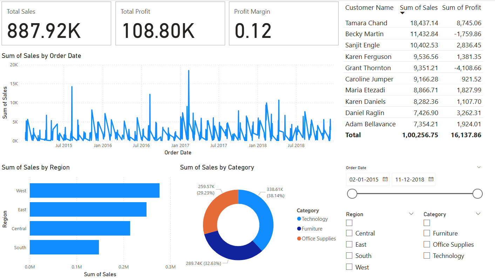

# 📊 Power BI Projects – Pavan Rajashekar Reddy

Welcome to my Power BI Portfolio!  
This repository contains interactive dashboards and reports I've built to explore and analyze real-world datasets using Power BI, DAX, Power Query, and data storytelling techniques.

---

## 🚀 Projects Included

### 🔹 1. Sales Performance Dashboard

**Dataset:** Superstore Sample Dataset  
📥 **[Download the PBIX File](./PowerBI_Sales_Dashboard.pbix)**  
📸 **Screenshot:**  

**Overview:**  
This dashboard provides key insights into sales, profit, and customer performance across different regions and product categories.

**Key Features:**
- KPIs: Total Sales, Total Profit, Profit Margin
- Visuals: Line Charts, Bar Charts, Pie Charts, Tables
- Top 10 Customers by Sales
- Dynamic Slicers for Region, Category, and Year
- DAX Measures for Profit Margin & Time Intelligence

**Tools Used:**
- Power BI Desktop
- DAX (Data Analysis Expressions)
- Power Query Editor
- Visual Analytics & UX Design

---

## 🔧 How to Use

1. Click the download link above
2. Open the `.pbix` file in Power BI Desktop
3. Explore the data model, visuals, and DAX formulas

---

## 📈 Upcoming Dashboards

- ✅ ERP Inventory Dashboard (Stone Industry)
- ✅ HR Analytics Dashboard
- ✅ Financial Performance Tracker
- ✅ Customer Segmentation & RFM Analysis

---

## 📫 Contact

**Pavan Rajashekar Reddy**  
📧 pavanrajashekarkatherapu@gmail.com  
🔗 [LinkedIn](https://linkedin.com/in/pavanrajashekar)

---

> “Turning raw data into business insights through the power of visuals and storytelling.”
